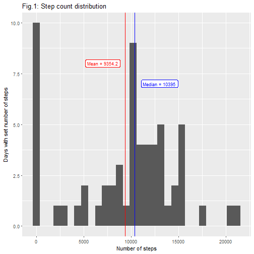
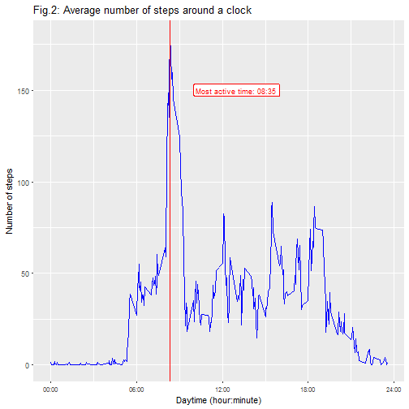
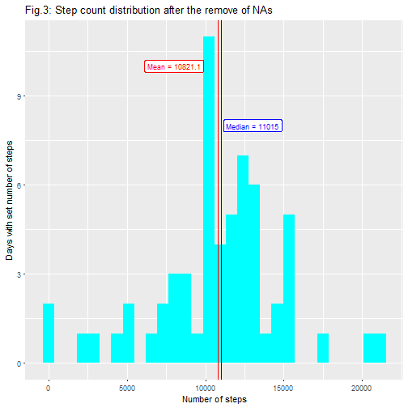
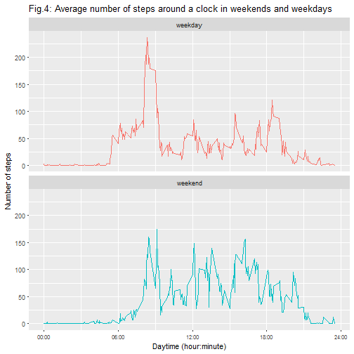

## What is it all about  
In this peer-graded assessment we are presented with a set of data, containing number of steps recorded from  an anonymous volunteer every day from 01.10.2012 to 30.11.2012. The data is detailed up to 5-minutes intervals within each day.
  
## Step 1. Loading and preprocessing the data
  

We start with downloading a zip file from the [course web-site](https://d396qusza40orc.cloudfront.net/repdata%2Fdata%2Factivity.zip), extracting a csv out of it, and feeding it into a table named ```tMain```. No further transformations seem to be of need at this point.  
  
_Block of code:_  

```r
library(data.table)
```

```
## data.table 1.10.4.3
```

```
##   The fastest way to learn (by data.table authors): https://www.datacamp.com/courses/data-analysis-the-data-table-way
```

```
##   Documentation: ?data.table, example(data.table) and browseVignettes("data.table")
```

```
##   Release notes, videos and slides: http://r-datatable.com
```

```r
library(ggplot2)
setwd("i:/CourserA/DATA_SCIENCE/05_ReproducibleResearch/Project1/")
fileURL<-"https://d396qusza40orc.cloudfront.net/repdata%2Fdata%2Factivity.zip"
download.file(fileURL, "./data/data.zip")
tMain <- fread(unzip("data/data.zip", "activity.csv"))
```
  
## Step 2. What is number of steps (total, mean) taken per day?  
This is the first look at our data set. It contains some NAs in "Number of Step" variable (see more detail in Step4). Dropping them, we get total number of steps equal to `570,608`. Average number of steps is `9,354.23`, and median is slightly different (`10,395.0`), suggesting that the distribution is not symmetrical (bimodal in our case).  
  
Additionally, we build a graph (histogram), showing how daily total number of steps is distributed within the two-months period.  
  
  
_Block of code:_  

```r
tDaily<-tMain[,sum(steps, na.rm=TRUE),by=date]
iTotalNumberOfSteps<-sum(tDaily$V1)
iAverageNumberOfSteps<-mean(tDaily$V1)
iMedianNumberOfSteps<-median(tDaily$V1)
# plotting the graph
ggplot(data=tDaily, aes(tDaily$V1)) + geom_histogram() +
  geom_vline(xintercept = iAverageNumberOfSteps, color="red") +
  geom_vline(xintercept = iMedianNumberOfSteps, color="blue") +
  annotate("label", x = 7000, y=8, label=paste("Mean =",round(iAverageNumberOfSteps,1)), size=3, color="red") +
  annotate("label", x = 13000, y=7, label=paste("Median =",round(iMedianNumberOfSteps,1)), size=3, color="blue") +
  labs(title="Fig.1: Step count distribution", x="Number of steps", y="Days with set number of steps")
```


  
  
## Step 3. What is the average daily activity pattern?
  
This time we are investigating the distribution of our variable (number of steps) around the clock (on the average). Another difference is that now we explore not the frequencies but a time trend.  
We found that most walking activity occurs at `08:35`, probably when our volunteer goes to his/her place of work or study. Unsurprisingly, there's almost no activity at night, from 24:00 to approximately 5:30 a.m.
  
_Block of code:_  

```r
tDayTime<-tMain[,sum(steps, na.rm=TRUE)/61,by=interval]
iTimeMaxSteps<-tDayTime$interval[which.max(tDayTime$V1)]
# some unnecessary niceties
sTimeMaxSteps<-paste(rep("0",4-nchar(as.character(iTimeMaxSteps))),as.character(iTimeMaxSteps),sep="")
sTimeMaxSteps<-paste(substring(sTimeMaxSteps,1,2),":",substring(sTimeMaxSteps,3,4),sep="")
# plotting the graph
ggplot(data=tDayTime, aes(interval, V1)) + geom_line(color="blue")+
  labs(title="Fig.2: Average number of steps around a clock", x="Daytime (hour:minute)", y="Number of steps")+
  theme(axis.text.x = element_text(size=8)) + 
  scale_x_continuous(labels = c("00:00", "06:00", "12:00", "18:00", "24:00"), 
                    breaks = c(0,600,1200,1800,2400)) +
  geom_vline(xintercept = iTimeMaxSteps, color="red") +
  annotate("label", x = 1300, y=150, label=paste("Most active time:", sTimeMaxSteps), size=3, color="red")
```


  
  
## Step 4. Imputing missing values
  
  There's a number of NAs in the original dataset. Specifically, a number of rows with NA is `2,304` (that is 13.1% of the total). Interestingly, all NAs are concentrated within certain dates (8 days overall) , so it is more correct to speak about "NA days" than individual NA values.  
  To fill the gaps we will assume that walking activity of the volunteer depends on time interval (around a clock) and on a day of a week. So each NA gap will be filled with average number of steps at the set time of day and day of week across our data set.  
  A new dataset is created (named `tMirr`), and new histogram is built. We can see now that new mean (`10,821`) and median (`11,015`) are much more close to each other than in the original data set. Which is unsurprising, because artificial additional mode (at x=0) now dissolved. Thus, having filled the NA gaps with some values, we made our dataset more analitically attractive.
  
_Block of code:_  

```r
# 4.1 Counting
iNAcount<-sum(is.na(tMain$steps))
iDaysNA<-sum(tMain[,any(is.na(steps)),by=date][[2]])
# 4.2 adding day of week to main data set
Sys.setlocale("LC_TIME", "C")
tMain[,DayWeek:=weekdays(as.Date(tMain$date),abbreviate = TRUE)]
# 4.3 creating a copy of data set (tMirr)
tMirr<-copy(tMain)
tMirr$steps<-as.numeric(tMirr$steps)
# 4.4 Filling the gaps
vDaysNA<-tMain[,.(any(is.na(steps))), by=.(DayWeek,date)]
vDaysNA<-vDaysNA[vDaysNA$V1,.(date, DayWeek)]
for(id in 1:nrow(vDaysNA)) {
  naDate<-vDaysNA$date[id]
  naDayWeek<-vDaysNA$DayWeek[id]
  tMirr[tMirr$date==naDate]$steps<-round((tMain[DayWeek==naDayWeek,mean(steps, na.rm = TRUE),
                                                by=interval]$V1),0)
  }
# 4.5 calculating mean, mode
mirrMean<-mean(tMirr[,sum(steps),by=date]$V1)
mirrMedian<-median(tMirr[,sum(steps),by=date]$V1)
# Plotting the graph
ggplot(data=tMirr[,sum(steps),by=date], aes(V1)) + geom_histogram(fill="cyan") +
  geom_vline(xintercept = mirrMean, color="red") +
  geom_vline(xintercept = mirrMedian, color="blue") +
  annotate("label", x = 8000, y=10, label=paste("Mean =",round(mirrMean,1)),size=3, color="red") +
  annotate("label", x = 13000, y=8, label=paste("Median =",round(mirrMedian,1)),size=3, color="blue") +
  labs(title="Fig.3: Step count distribution after the remove of NAs", x="Number of steps", 
       y="Days with set number of steps")
```


  
## Step 5. Are there differences in activity patterns between weekdays and weekends?
  
  Indeed, as the graph shows, on weekends our volunteer is on the average more active throughout the day. There's no pronounced peak like on weekdays in the morning, and he starts to move around a little bit later.
  
_Block of code:_  

```r
tMirr[,wFlag:="weekday"]
tMirr$wFlag[tMirr$DayWeek%in%c("Sat", "Sun")]<-"weekend"
# Plotting the graph
ggplot(data=tMirr[,mean(steps),by=.(interval,wFlag)], aes(interval, V1, color=factor(wFlag))) +
  geom_line() +
  facet_wrap(~wFlag, dir="v") +
  theme(legend.position = "none") +
  labs(title="Fig.4: Average number of steps around a clock in weekends and weekdays",
       x="Daytime (hour:minute)", y="Number of steps") +
  theme(axis.text.x = element_text(size=8)) +
  scale_x_continuous(labels = c("00:00", "06:00", "12:00", "18:00", "24:00"), breaks = c(0,600,1200,1800,2400))
```



